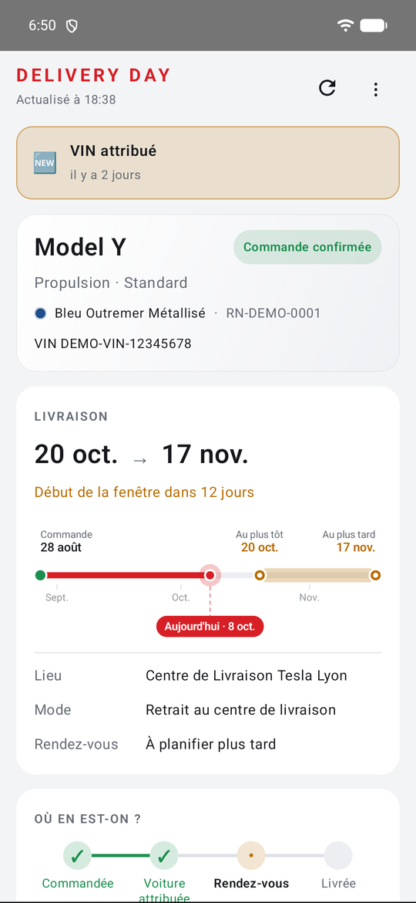
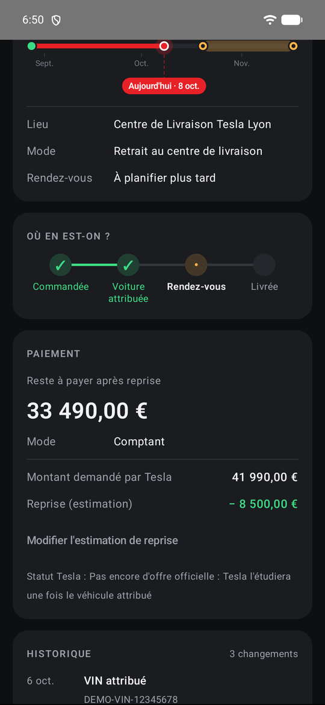
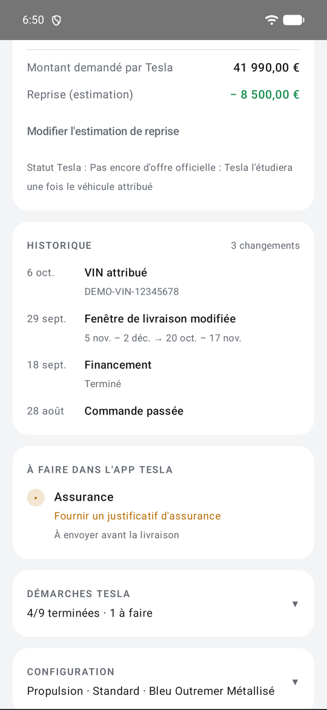
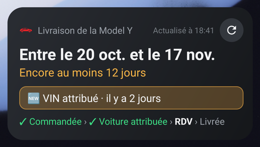
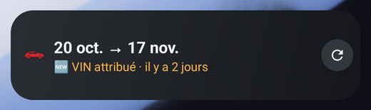
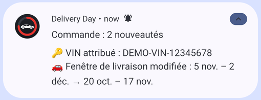

# Delivery Day

*[English version](README.md)*

Application Android pour suivre une commande Tesla jusqu'à la livraison : fenêtre de livraison
avec compte à rebours et frise, bandeau « du nouveau ? », historique des changements, paiement
et reprise, démarches Tesla, et un widget pour l'écran d'accueil. Des notifications lisibles,
uniquement pour ce qui compte (VIN attribué, fenêtre de livraison, rendez-vous, montant à payer,
offre de reprise…).

Disponible en français et en anglais (suit la langue du téléphone).

  
  
  

  
  

  

Les captures utilisent des données de démonstration (commande fictive).

> **Non officielle.** Sans lien avec Tesla. L'app lit la commande via l'interface privée utilisée
> par l'app mobile Tesla, que Tesla peut modifier ou bloquer à tout moment. Les identifiants sont
> saisis uniquement sur tesla.com ; les jetons d'accès sont chiffrés (Android Keystore) sur le téléphone.

## Installation

1. Télécharger le dernier `DeliveryDay-x.y.z.apk` depuis la page [Releases](../../releases/latest)
   et l'ouvrir sur le téléphone. Autoriser l'installation depuis cette source ; sur Samsung, il peut
   falloir désactiver le « Blocage auto ».
2. Ouvrir l'app, toucher **Se connecter avec son compte Tesla**, se connecter sur tesla.com.
   À la fin, si Android demande quelle app doit ouvrir le lien, choisir **Delivery Day**.
3. Autoriser les notifications. Sur Samsung / Xiaomi, régler l'utilisation de la batterie de l'app
   sur **Non restreinte**, sinon les vérifications en arrière-plan peuvent être bloquées.
4. Facultatif : ajouter le widget (appui long sur l'écran d'accueil → Widgets → Delivery Day).

La connexion crée une session séparée : elle n'a aucun effet sur l'app Tesla officielle.

## Fonctionnement

- Vérification toutes les heures, toutes les 15 min quand la livraison approche (VIN attribué,
  rendez-vous fixé, ou fenêtre dans moins de 3 semaines), au plus toutes les 3 h la nuit ;
  tirer l'écran vers le bas pour actualiser à tout moment.
- Les textes de Tesla sont demandés dans la langue du téléphone, pour le pays de la commande ;
  les dates de la fenêtre de livraison sont comprises en français, anglais, allemand, espagnol,
  italien, néerlandais, etc.
- La première vérification enregistre l'état actuel ; les suivantes signalent les vrais changements.
  Un changement de langue du téléphone n'est pas signalé comme une nouveauté.

## Vie privée et sécurité

- **Aucun serveur à nous, aucune statistique, aucune pub.** L'app ne parle qu'aux serveurs de Tesla
  (`auth.tesla.com`, `owner-api.teslamotors.com`, `akamai-apigateway-vfx.tesla.com`), uniquement en HTTPS.
- **Votre mot de passe n'arrive jamais dans l'app.** La connexion se fait sur la page de Tesla, dans le
  navigateur (OAuth avec PKCE et vérification du `state`) ; l'app ne reçoit qu'un jeton d'accès.
- **Les jetons sont chiffrés** avec une clé conservée dans l'Android Keystore du téléphone, non exportable.
- **Les données de la commande restent sur le téléphone**, dans l'espace privé de l'app, exclues des
  sauvegardes cloud. La déconnexion efface les jetons et les données de la commande (seuls l'estimation
  de reprise et l'historique des changements sont conservés).
- **Écran verrouillé :** les notifications indiquent seulement « Nouveauté sur la commande » tant que le
  téléphone n'est pas déverrouillé.
- Pour fermer aussi toutes les sessions côté Tesla, changez le mot de passe de votre compte Tesla.

Une faille de sécurité ? Voir [SECURITY.md](SECURITY.md).

## Compilation

1. Ouvrir le dossier dans Android Studio (JDK 17) et laisser Gradle synchroniser.
2. Lancer sur un téléphone, ou `./gradlew assembleDebug`.
3. Tests : `./gradlew testDebugUnitTest`.

Les APK officiels sont compilés, signés et publiés automatiquement à partir des étiquettes de version
(voir `RELEASING.md`). Un APK compilé soi-même a une signature différente : désinstaller la version
officielle avant de l'installer.

## Limites

- API non officielle : elle peut changer sans préavis. `/tasks` refuse les anciennes versions d'app
  (« Update App ») ; l'app annonce la version de l'app Tesla installée sur le téléphone (4.61.0 par défaut).
- Les codes d'options ne sont décodés qu'en partie (Tesla ne publie pas de liste officielle) ;
  les codes inconnus s'affichent tels quels.
- Le format de l'offre de reprise et du rendez-vous n'est connu qu'une fois envoyé par Tesla ;
  ils sont détectés par heuristique.

## Licence

[MIT](LICENSE). Tesla, Model Y et les noms associés sont des marques de Tesla, Inc. ; ce projet n'est
ni affilié à Tesla, ni approuvé, ni sponsorisé par Tesla.
