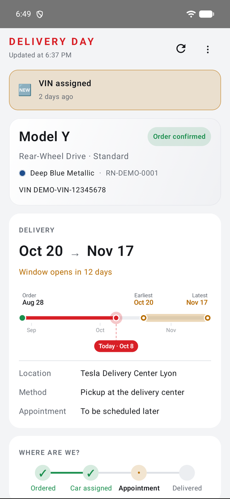
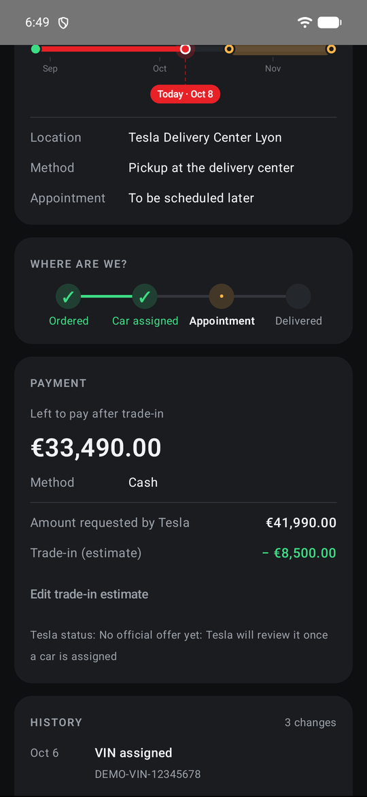
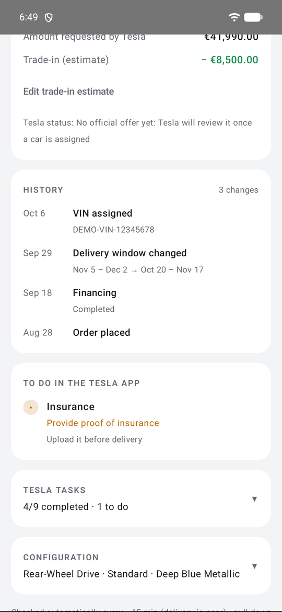
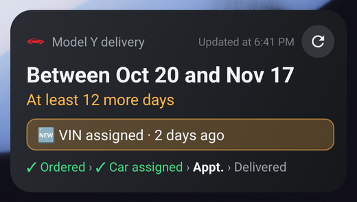
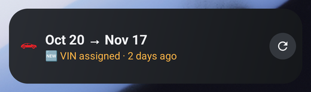
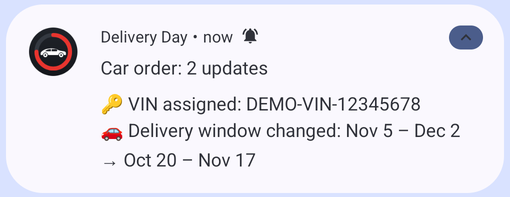

# Delivery Day

*[Version française](README.fr.md)*

Android app to follow a Tesla order until delivery: delivery window with a countdown and a
timeline, "anything new?" banner, change history, payment and trade-in, Tesla tasks, and a
home screen widget. Readable notifications only for changes that matter (VIN assigned,
delivery window, appointment, amount due, trade-in offer…).

Available in English and French (follows the phone's language).

  
  
  

  
  

  

Screenshots use demo data (fictitious order).

> **Unofficial.** Not affiliated with Tesla. The app reads the order through the private API
> used by the Tesla mobile app, which Tesla can change or block at any time. Credentials are
> only typed on tesla.com; tokens are stored encrypted (Android Keystore) on the phone.

## Install

1. Download the latest `DeliveryDay-x.y.z.apk` from the [Releases](../../releases/latest) page and
   open it on the phone. Allow installing apps from that source; on Samsung, "Auto Blocker" may
   need to be turned off.
2. Open the app, tap **Sign in with your Tesla account**, sign in on tesla.com.
   At the end, if Android asks which app should open the link, choose **Delivery Day**.
3. Allow notifications. On Samsung / Xiaomi, set the app's battery usage to **Unrestricted**,
   otherwise background checks may be blocked.
4. Optionally add the widget (long press on the home screen → Widgets → Delivery Day).

Signing in creates a separate session: it does not affect the official Tesla app.

## How it works

- Checks every hour, every 15 min once delivery gets close (VIN assigned, appointment set, or
  window less than 3 weeks away), at most every 3 hours at night; pull down to refresh anytime.
- Tesla's texts are requested in the phone's language for the order's country; delivery window
  dates are understood in English, French, German, Spanish, Italian, Dutch and more.
- The first check only records the current state; later checks notify about real changes.
  A language switch is not reported as a change.

## Privacy & security

- **No server of ours, no analytics, no ads.** The app only talks to Tesla's own servers
  (`auth.tesla.com`, `owner-api.teslamotors.com`, `akamai-apigateway-vfx.tesla.com`), over HTTPS only.
- **Your password never reaches the app.** You sign in on Tesla's page in your browser (OAuth with
  PKCE and `state` check); the app only receives an access token.
- **Tokens are encrypted** with a key kept in the phone's Android Keystore, which cannot be exported.
- **Order data stays on the phone**, in the app's private storage, excluded from cloud backups.
  Signing out deletes the tokens and order data (only your trade-in estimate and the change history are kept).
- **Lock screen:** notifications only say "Order update" until the phone is unlocked.
- To end every session on Tesla's side as well, change your Tesla account password.

Found a security issue? See [SECURITY.md](SECURITY.md).

## Build

1. Open the folder in Android Studio (JDK 17) and let Gradle sync.
2. Run on a phone, or `./gradlew assembleDebug`.
3. Tests: `./gradlew testDebugUnitTest`.

Official APKs are built, signed and published automatically from version tags (see `RELEASING.md`).
An APK you build yourself has a different signature: uninstall the official one before installing it.

## Limits

- Unofficial API: it can change without notice. `/tasks` refuses old app versions ("Update App");
  the app announces the version of the Tesla app installed on the phone (fallback 4.61.0).
- Option codes are only partly decoded (Tesla publishes no official list); unknown codes are shown as-is.
- The trade-in offer and appointment formats are unknown until Tesla sends them; they are detected heuristically.

## License

[MIT](LICENSE). Tesla, Model Y and related names are trademarks of Tesla, Inc.; this project is
not affiliated with, endorsed or sponsored by Tesla.
